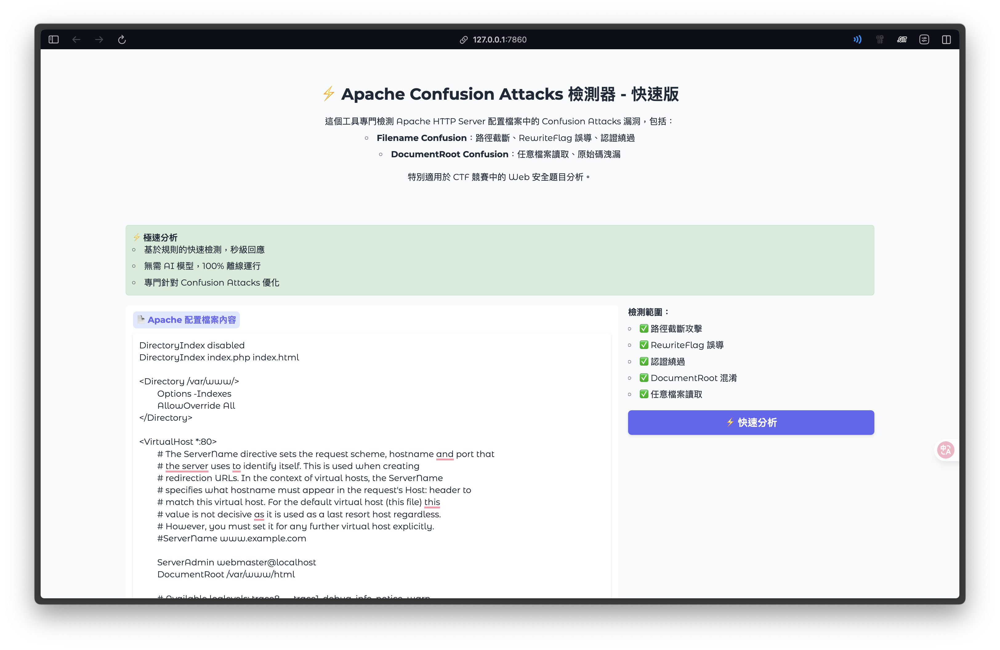

# Apache-Confusion-Attacks-Detector

隨著關於 Apache HTTP Server 的 [Confusion Attacks](https://blog.orange.tw/posts/2024-08-confusion-attacks-ch/) 相關漏洞的公開，未來將有機會出現許多類似的 CTF 題型。因此我製作了檢測工具及 AI Prompt。

## 檢測工具程式

你可以透過執行 [script.py](script.py) 開啟 WebUI 偵測漏洞是否存在，以及可利用之方向。

## AI Prompt

除了檢測程式外，我也製作了一個 AI 的 Prompt。透過判斷 Apache Conf 檔，找到弱點並提供利用方向。Prompt 請見：[prompt.txt](prompt.txt)。

## 免責聲明

本專案僅供教育、學習和研究目的使用。使用者必須確保僅在自己擁有或獲得明確授權的系統上使用此專案，並遵守所在地區的法律法規。嚴禁用於未經授權的滲透測試或任何惡意活動。本專案基於已知攻擊模式進行檢測，無法保證 100% 準確性，檢測結果僅供參考。開發者對於使用本專案所造成的任何直接或間接損失不承擔責任。使用本專案即表示您同意承擔相關風險並合法合規使用。
